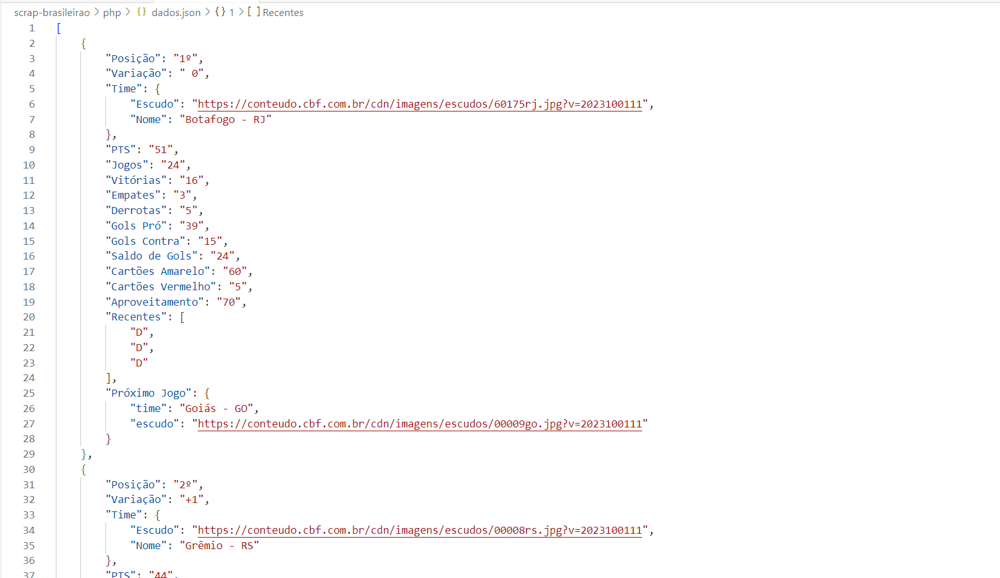

# Scraper do brasileirão

O script utiliza o site oficial da CBF, nos exemplos são extraídos dados da tabela da Série A

https://www.cbf.com.br/futebol-brasileiro/competicoes/campeonato-brasileiro-serie-a/2023

## PHP

Para executar bastar rodar o comando:

``
php index.php
``

## NodeJS

Para executar o código em NodeJS é necessário instalar as dependencias com o comando dentro do diretório do script:

``
yarn install
``

Para executar o script basta fazer:

``
node index.js
``

## Python

Para rodar o código em Python é necessário instalar as dependencias com o comando no diretório python: 

``
pip install -r requirements.txt
``

Para executar o script basta fazer:

``
python index.py
``

## Ruby

Certifique-se de que você tenha o Bundler instalado no seu sistema. O Bundler é uma ferramenta que ajuda a gerenciar as dependências das gemas em um projeto Ruby. Se você não tiver o Bundler instalado, pode instalá-lo com o seguinte comando:

``
gem install bundler
``

Abra um terminal, navegue até o diretório do seu projeto e execute o seguinte comando para instalar as gemas listadas no Gemfile:

``
bundle install
``

Para executar o script basta fazer:

``
ruby index.rb
``

## GoLang

Para compilar o arquivo .go rode o comando, ele vai gerar um .exe dá aplicação:

``
go build index.go
``

Para executar rode o comando:

``
./index
``